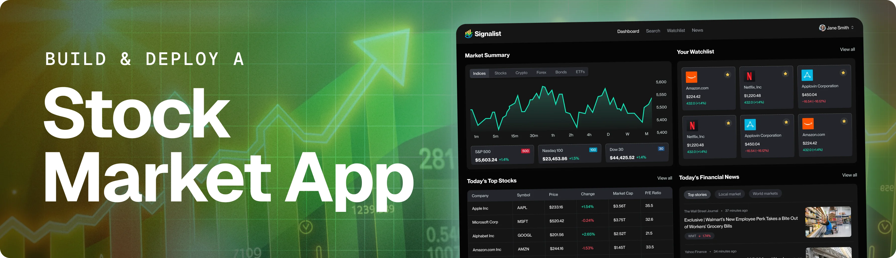

<div align="center">
  <!-- <br />
    
  <br /> -->

  <div>
    
    
    
    <br/>
    
    
    
  </div>

  <h3 align="center">Quotient — AI-Powered Stock Market Tracker</h3>
  <p align="center">Real-time stock tracking, personalized alerts, and AI-driven market insights.</p>
</div>

---

## 📋 Table of Contents

1. ✨ [Introduction](#introduction)
2. ⚙️ [Tech Stack](#tech-stack)
3. 🔋 [Features](#features)
4. 🛠️ [Challenges & Fixes](#challenges)
5. 🤸 [Quick Start](#quick-start)

---

## <a name="introduction">✨ Introduction</a>

**Quotient** is a full-stack, AI-powered stock market tracking application I built as part of my development portfolio. It combines real-time financial data, event-driven background workflows, and AI-generated market summaries into a polished, production-ready product.

The app allows users to track live stock prices, manage a personal watchlist, set price alert thresholds, and receive automated daily market digests via email — all powered by a modern Next.js architecture with MongoDB, Better Auth, Inngest, and Groq AI.

---

## <a name="tech-stack">⚙️ Tech Stack</a>

- **[Next.js](https://nextjs.org/docs)** — Full-stack React framework handling both the frontend UI and backend API routes with server-side rendering and server actions.

- **[Better Auth](https://www.better-auth.com/)** — Framework-agnostic TypeScript authentication library powering email/password login, session management, and user accounts.

- **[Finnhub](https://finnhub.io/)** — Real-time financial data API providing live stock quotes, company profiles, financial metrics, and market news.

- **[Inngest](https://www.inngest.com/)** — Event-driven workflow platform used to orchestrate background jobs including alert checks, daily email digests, and AI inference steps.

- **[Groq AI](https://groq.com/)** — Used via `step.ai.wrap()` with the Vercel AI SDK to generate personalized welcome emails and daily news summaries at no cost.

- **[MongoDB](https://www.mongodb.com/)** — NoSQL database storing users, watchlists, and alert configurations.

- **[Nodemailer](https://nodemailer.com/)** — Handles transactional email delivery for welcome emails, daily digests, and price alert notifications.

- **[Shadcn/ui](https://ui.shadcn.com/)** + **[TailwindCSS](https://tailwindcss.com/)** — Component library and utility CSS framework used to build a clean, dark-mode-first responsive UI.

- **[TradingView Widgets](https://www.tradingview.com/widget/)** — Embedded interactive charts including candlestick charts, market heatmaps, and financial overviews. Integrated via a custom `useTradingViewWidget` hook with memoized rendering.

- **[TypeScript](https://www.typescriptlang.org/)** — Strict typing across the entire codebase for reliability and maintainability.

---

## <a name="features">🔋 Features</a>

👉 **Stock Dashboard** — Real-time market overview with interactive candlestick and baseline charts, a zoomable S&P 500 heatmap grouped by sector, and a live market news feed.

👉 **Intelligent Search** — Fast stock search powered by the Finnhub API with watchlist status indicators directly in results.

👉 **Watchlist Management** — Add and remove stocks from a personal watchlist with live price, change percentage, market cap, and P/E ratio data displayed in a sortable table.

👉 **Price Alerts** — Set upper and lower price threshold alerts per stock. Alerts are evaluated on a schedule via Inngest background jobs and trigger instant email notifications.

👉 **AI-Powered Daily Digest** — Every day at noon, Inngest automatically fetches each user's watchlist news, summarizes it using Groq AI (Llama 3), and delivers a personalized email digest.

👉 **Personalized Welcome Email** — On sign-up, an AI-generated welcome message is crafted based on the user's investment goals, risk tolerance, and preferred industry.

👉 **Company Insights** — Deep-dive pages per stock with TradingView-powered financials, technical analysis, company profile, and recent news.

👉 **Authentication** — Secure email/password sign-up and sign-in with session management via Better Auth.

👉 **Performance Optimized** — TradingView widgets are wrapped in `React.memo` to prevent unnecessary re-renders given their heavy script injection cost.

---


## <a name="quick-start">🤸 Quick Start</a>

**Prerequisites**

- [Git](https://git-scm.com/)
- [Node.js](https://nodejs.org/en)
- [npm](https://www.npmjs.com/)

**Clone the repository**

```bash
